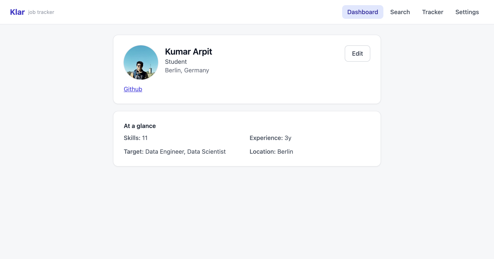

# Klar v2.1

**A privacy-first, AI-assisted job search workspace for Germany and nearby European markets.**

Klar reads your résumé, finds live openings, explains your fit, helps you tailor each application, and keeps the entire search organised in one browser-based workspace.

[**Open Klar →**](https://karpit0499.github.io/klar/) · [View the changelog](CHANGELOG.md)

> **Current release: v2.1**  
> A reliability-focused release that strengthens bilingual résumé tailoring, fixes responsive-layout and state-consistency issues, improves onboarding and Settings, and makes deployments safer for returning users.




---

## What changed in v2.1

Klar v2.1 puts the finished v2 experience on a more dependable foundation:

- **English and German tailored résumés** are both available for every supported job.
- **Aggressive, job-specific rewriting** reshapes summaries and bullets while preserving employers, dates, qualifications, tools, and other protected facts.
- **Evidence guards** keep generated claims grounded in the uploaded résumé.
- **Responsive layout fixes** prevent text overlap, horizontal overflow, unsafe mobile drawers, and controls hidden behind bottom navigation.
- **Search state now survives navigation** between Search, Dashboard, Tracker, and Settings.
- **Scores and saved state remain consistent** across job cards, drawers, tracker views, and browser reloads.
- **Partial scoring failures are handled honestly**: failed batches are omitted, explained, and retried instead of appearing as fake `0/100` matches.
- **Onboarding and Settings are fully bilingual**, with Groq, optional Adzuna credentials, Language, and Appearance clearly available.
- **Service-worker updates are deployment-safe**, reducing the risk of returning users loading stale HTML that references deleted bundles.

See [CHANGELOG.md](CHANGELOG.md) for the complete v1 → v2 → v2.1 history.

---

## What Klar can do

### Discover and understand jobs

- Gather live vacancies from public job feeds and employer applicant-tracking systems.
- Search across **Germany, Austria, Switzerland, the Netherlands, Luxembourg, and Liechtenstein**; source coverage varies by market.
- Use employment-type, student/Werkstudent, distance, recency, German-language, and visa-sponsorship filters.
- Hide irrelevant jobs and save searches with a **new-since-last-check** view.
- Translate job descriptions between German and English.

### Match jobs to your profile

- Parse PDF and DOCX résumés in the browser.
- Run a two-stage pipeline: deterministic pre-filtering followed by LLM re-ranking.
- Show an explainable fit score with factors the user can re-weight.
- Aggregate recurring skill gaps into a practical **what to learn next** summary.
- Keep partial failures visible and recoverable instead of converting them into misleading low scores.

### Build stronger applications

- Replace or re-upload a résumé without losing preferences or tracked jobs.
- Generate a job-specific résumé as **ATS-safe DOCX** or text-based PDF.
- Choose **English or German output independently of the job-description language**.
- Show résumé-to-job-description keyword coverage and missing-skill gaps.
- Generate a cover-letter draft, interview questions, answer scaffolds, and honest gap-handling strategies.
- Add optional Adzuna salary benchmarks and a German **Brutto → Netto** estimate.
- Assemble the deliverables for one role in a single application workspace.

### Organise the search

- Save jobs to a Kanban-style application tracker.
- Switch between board and list views.
- Add notes, contacts, reminders, follow-ups, and status changes.
- Flag older saved postings as potentially stale.
- Export job results and tracker data as CSV, XLSX, or PDF.
- Back up and restore Klar data as JSON.

### Use it comfortably anywhere

- Full **English/German interface**.
- Light, dark, and system appearance modes.
- Desktop navigation rail and mobile bottom navigation.
- Accessible focus states, reduced-motion support, readable typography, and touch-friendly controls.
- Installable Progressive Web App with offline app-shell fallback.

---

## Privacy model

Klar is designed without an application backend that stores your profile or job-search history.

- Your profile, preferences, tracked applications, dashboard data, and cached results live in your browser through IndexedDB.
- AI requests go **directly from your browser to Groq** using the API key you provide.
- Klar does not receive or store your Groq key, and credentials are excluded from Klar backup exports.
- A small allow-listed Cloudflare Worker proxies only the job APIs that cannot be called directly from a browser.
- Optional client-side résumé encryption uses AES-GCM with a passphrase-derived key. The passphrase is not stored.
- Settings includes export, restore, and delete-all controls.

**Important:** content required for an AI feature is sent to Groq for processing. It is not sent to or stored by a Klar-controlled application server.

---

## Getting started

You need:

- A current desktop or mobile browser.
- A free [Groq API key](https://console.groq.com/).
- Optionally, an Adzuna App ID and App Key for additional listings and salary data.

Then:

1. [Open Klar](https://karpit0499.github.io/klar/).
2. Add your Groq key on the first setup screen.
3. Optionally add both Adzuna credentials.
4. Choose your language and appearance.
5. Upload a PDF or DOCX résumé and confirm the extracted profile.
6. Set your target roles, location, and filters.
7. Search, inspect the fit explanations, and save promising jobs.
8. Open a saved job to create its application materials.

Your keys remain in browser storage on that device and are not included in exported backups.

---

## Supported sources and markets

Klar combines direct browser requests with a narrowly scoped proxy:

| Source type | Examples | Connection |
|---|---|---|
| Public job APIs | Arbeitnow | Direct from the browser |
| Employer ATS boards | Greenhouse, Lever, Ashby | Direct from the browser |
| Government/partner feeds | Bundesagentur für Arbeit | Through the allow-listed Worker |
| Optional commercial feed | Adzuna | Through the Worker using user-supplied credentials |

The employer registry includes more than 200 verified and candidate ATS boards. Availability, market coverage, quotas, and listing freshness depend on the original providers.

---

## How matching works

```text
Résumé upload
    ↓
Client-side PDF/DOCX extraction
    ↓
Structured profile + preferences
    ↓
Live job gathering and deduplication
    ↓
Local filters and deterministic/semantic pre-filter
    ↓
Groq re-ranking with factor breakdown
    ↓
Matches, recurring skill gaps, tracker, and application tools
```

The shortlist-first architecture keeps latency and API usage lower than scoring every gathered job with an LLM.

---

## Technology

- React 18, TypeScript, Vite, and Tailwind CSS
- Dexie/IndexedDB for local persistence
- pdf.js and Mammoth for browser-side résumé extraction
- Groq for structured parsing, ranking, rewriting, translation, and interview preparation
- `docx`, SheetJS, and client-side PDF generation for downloadable deliverables
- Cloudflare Workers for the restricted BA/Adzuna proxy
- GitHub Actions and GitHub Pages for static deployment
- Web Crypto API for optional résumé encryption
- `@dnd-kit` for the application tracker

---

## Local development

Requirements: Node.js 20 or newer and npm.

```bash
git clone https://github.com/karpit0499/klar.git
cd klar
npm install
cp .env.example .env.local
npm run dev
```

Set the Worker URL in `.env.local` when proxy-backed sources are needed.

### Quality checks

```bash
node --check public/sw.js
npm run typecheck
npm test
npm run build
```

The production site is deployed from `main` through the repository's GitHub Pages workflow.

---

## Honest limitations

- Coverage varies by country and source. Many employers expose no public job API.
- Adzuna is optional and subject to its own country coverage, quota, and availability.
- AI output should be reviewed before submission; Klar is an assistant, not a recruiter or factual authority.
- Résumé tailoring is constrained to evidence in the uploaded résumé and should not invent missing experience.
- The German net-salary calculator is an estimate, not tax advice.
- Saved-posting staleness is based on age because browsers cannot reliably inspect every cross-origin destination.

---

## Version history

- **v1** — Original privacy-first job discovery, matching, dashboard, tracker, exports, cover letters, filters, evaluation harness, and PWA.
- **v2** — Major UI overhaul plus multi-country discovery, richer filtering, saved searches, résumé/application tooling, salary features, localization, accessibility, dark mode, and optional encryption.
- **v2.1** — Bilingual résumé-deliverable improvements and a full reliability, responsive-layout, state-consistency, scoring, parsing, and deployment-safety pass.

Read the detailed [CHANGELOG.md](CHANGELOG.md).

---

## License

Klar's source is public so its behaviour and privacy model can be inspected, but the project is **not open source**. Copying, reuse, and redistribution are restricted. See [LICENSE](LICENSE).

---

*Klar means “clear” in German. Built by Kumar Arpit.*
