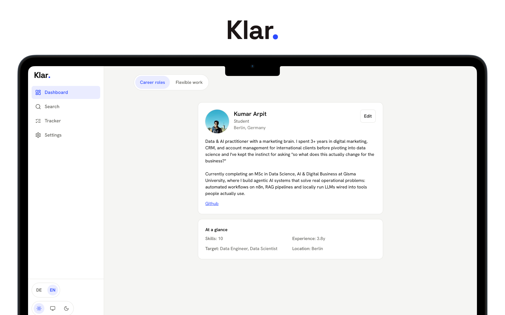
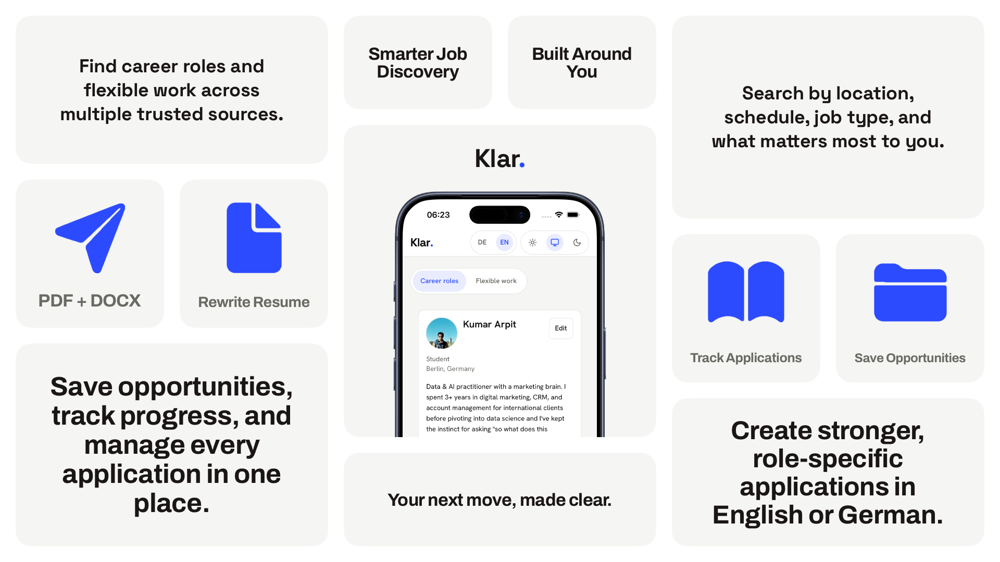

Klar is a private, browser-based workspace for finding work, understanding job
fit, preparing grounded applications, and tracking every opportunity from first
look to final decision.

**Current release: v2.6.1 Developer Preview**

[**Open Klar →**](https://karpit0499.github.io/klar/) ·
[Knowledge Base →](https://karpit0499.github.io/klar/kb/) ·
[Browse KB source →](knowledge-base/content/) ·
[What changed →](CHANGELOG.md) ·
[Report an issue →](https://github.com/karpit0499/klar/issues)


_Dashboard_


_Highlights from Latest Update_

---

v2.6.1 is the stability, source-integrity, and experience release. It preserves
Klar's deterministic score separately from the AI provider's advisory opinion;
moves Resume into a dedicated workspace; expands German localization and
cancellable-search safeguards; adds protected in-app bug/suggestion reporting;
and serves the repaired Knowledge Base with Klar on GitHub Pages. It retires
141 dead speculative ATS endpoints, stages 100 verified boards behind a
scheduled Worker cache, and adds 100 honest official flexible-work routes.

v2.6 is the measurement-first foundation. It adds a versioned,
evidence-linked ranking snapshot; source-health and privacy-reviewed issue
reporting; semantic English/German cover-letter DOCX and recruiter-message
checks; an internal code-generated resume design lab; and a hardened macOS
ARM64/Windows x64 desktop preview for a managed, signed local-model package.
The desktop artifacts remain unsigned and internal. Adapter training, blinded
human quality studies, production signing, and public optional local
intelligence remain explicit graduation gates rather than claimed outcomes.

v2.6.0.1 is the production-format and source-continuity hotfix. It promotes the
approved cross-compatible resume structure to both DOCX and browser-print PDF,
keeps every exported claim inside the canonical resume evidence, migrates the
Bundesagentur search connector from the rejected internal v4 route to the
currently active v6 route and schema, and refreshes the web shell cache. The BA
detail lookup remains on its working v4 detail route; the Cloudflare Worker
contract and privacy boundary are unchanged.

## What Klar does

### Career search that respects the role and the market

Klar searches public job feeds and employer career pages, removes duplicate
listings, applies local filters, and ranks the opportunities that remain.

The latest version fixes the most important part of that pipeline: a matching title alone
is not enough. Klar now evaluates these separately:

- **Role** — an account-management search does not admit data science,
  engineering, planning, or unrelated leadership roles.
- **Job market / field** — email, CRM, and digital-marketing account work is not
  treated as equivalent to automotive rental sales or cybersecurity software
  sales.
- **Seniority** — junior searches reject clearly senior, principal, lead, head,
  director, strategic, and enterprise-level titles.
- **Location** — a radius search does not silently accept overseas or
  unlocatable ATS results. Worldwide remote roles bypass distance only when
  remote work was requested.
- **Specialty** — relevant experience such as lifecycle marketing, retention,
  campaign automation, Klaviyo, Mailchimp, or HubSpot can refine already
  relevant results.

Resume skills support ranking only after a job passes those gates. A secondary
Python or SQL skill cannot turn an unrelated technical role into a career match.

Both local ranking modes use the same relevance rules:

- **Keyword** uses deterministic title, market, specialty, recency, and
  supporting-skill signals.
- **Semantic** uses local vocabulary-vector similarity. It is private and has no
  AI cost, but it is not a neural embedding model.

AI matching is optional and attention-based: search stays private and
zero-token, while **Explain this job with AI** can enrich any one opened result
and caches that explanation. The compatibility switch may automatically enrich
at most the top 40 locally ranked jobs; that boundary never limits how many
relevant jobs Klar displays.

Saved historical scores retain their original model label and value. In the
Tracker, **Rescore with current profile** is an explicit action; Klar never
silently reinterprets an earlier score under ranking v2.

### Search diagnostics you can act on

Every search records:

- which sources were requested and which succeeded;
- raw results and duplicates;
- employment, company, age, distance, role, and market removals;
- locations that could not be distance-checked;
- jobs hidden by German-language or visa filters;
- unfinished scoring; and
- the final result count.

If the answer is zero, Klar explains whether the problem was the sources, the
radius, the requested role and market, another filter, or unfinished matching.
It does not fill an empty result page with unrelated jobs.

### Resume and profile workspace

Klar keeps one canonical resume behind search and application tools. You can:

- import PDF or DOCX, or build the resume manually;
- review and edit contact details, summary, experience, education, skills,
  projects, certifications, and languages;
- reorder sections and roles;
- see structural completeness checks;
- keep and restore earlier versions; and
- derive a thin matching profile without maintaining a second resume.

The career setup keeps target titles and **Job market / field** separate so an
account role can be searched within email marketing, CRM, healthcare, fintech,
or another intended market.

### Grounded application packets

For a saved job, Klar can prepare English and German material independently:

- an ATS-friendly tailored resume;
- a no-AI resume reorder that preserves every original sentence;
- a factual change review with accept, reject, and edit controls;
- keyword coverage from the posting;
- a grounded cover letter in Concise, Balanced, or Formal tone;
- a short recruiter message;
- interview questions and talking points; and
- one saved application packet with notes and generation history.

Packet download uses a single ZIP containing the DOCX resume and the required
semantic cover-letter DOCX. Filenames include candidate, company, role, and
language without leaking internal IDs. This avoids the multiple-download behavior that mobile
browsers commonly block.

New v2.6 packets store row-level schema defaults. Each generated resume, letter,
and recruiter message stores its own per-language content/generator contract;
each download records the source-artifact provenance and exact exporter used.
Older or mixed packet rows stay conservatively labelled historical even when
one artifact is regenerated, so Klar never silently calls untouched content a
v2.6 artifact.

From v2.6.0.1, production DOCX and PDF resumes share the approved A4,
single-column Arial layout: a compact identity block, an unlabeled profile,
semantic ruled section headings, compact role and date grouping, coloured real
bullets, and a combined skills-and-languages section. Klar uses the newest held
role as the subtitle because schema v2 has no independently reviewed profile
headline; it never presents the target vacancy title as experience. The three
research palettes remain visual references, while production uses one stable
blue accent until an explicit user-selected palette exists.

For resume tailoring, Klar rejects evidence-blocked rewrites at the decision,
edit, and export boundaries; malformed or omitted AI fields fall back to the
verified source resume, and change notes are derived locally. Cover-letter and
recruiter-message prompts project verified evidence and deterministic checks
catch known risky patterns, but those checks are not a complete factual audit.
Every generated letter and message still needs human review. The genuine
blinded writing gate remains HOLD, so v2.6 makes no per-output guarantee that a
model cannot invent a subtle claim.

### Flexible work without a resume

Flexible Work is a separate path for minijobs, part-time work, working-student
roles, temporary work, and evening, night, weekend, or seasonal shifts.

It searches public sources and verified employer routes, returns progressive
results inside a bounded session, identifies open-application routes when an
employer has no individual listing, and can create a short employer message and
printable profile card from optional details.

Klar never submits an application or fills an employer form on the user's
behalf.

### Tracker, exports, and salary context

Applications move through a board or list with notes, contacts, reminders,
follow-ups, and history. Search and tracker results can be exported, while the
salary tools provide market context and an estimated German take-home amount.

---

## Private by design

Klar has no application server that stores a person's career history.

- Resumes, profiles, preferences, saved jobs, packets, and tracker data live in
  the browser.
- Optional vault protection encrypts sensitive local data and saved credentials.
- Standard backups exclude API credentials.
- Complete encrypted backups can move credentials without exposing them.
- Readable exports are separate, clearly warned, and require confirmation.
- Employer-source relays can reach only fixed, published job endpoints.
- The Groq relay accepts only the required Groq routes, forwards a key in the
  authorization header, disables caching, and never stores or echoes the key.

When an AI action is used, the minimum information required for that action is
sent to the configured provider. Local search, filtering, tracking, backups,
exports, and no-AI tailoring do not require a Groq key.

If the vault passphrase is lost, Klar cannot recover it.

---

## Markets, languages, and devices

The interface is available in **English and German** and is designed for desktop
and mobile browsers.

Career-search regions:

- Germany
- Austria
- Switzerland
- Netherlands
- Luxembourg
- Liechtenstein

Flexible Work employer coverage is currently focused on Germany. Actual
vacancies depend on the original feeds and employers.

---

## Get started

You need a current browser. A Groq API key is requested only when an AI action
starts; Adzuna credentials are optional.

1. [Open Klar](https://karpit0499.github.io/klar/).
2. Choose Career roles or Flexible work.
3. Import a resume, build one manually, or continue resume-free for Flexible
   Work.
4. Set the target title, job market, seniority, location, and radius.
5. Search, review the diagnostics, save useful jobs, and prepare applications.
6. Create regular backups because the workspace belongs to that browser.

Klar can be installed from the browser for a more app-like experience.

---

## AI engine

The default provider is Groq through Klar's fixed Worker relay. Settings can use
another OpenAI-compatible HTTPS endpoint, select separate full and fast models,
list the models offered by that endpoint, and test the connection.

Local HTTP model servers cannot be reached from the hosted HTTPS app because
browsers block mixed content. A self-hosted Klar instance can configure an
appropriate compatible endpoint.

v2.6 also contains a managed Electron developer preview. Its main process runs
a pinned llama.cpp server only on loopback and accepts only checksum- and
signature-verified model packages. The tested Qwen3.5-9B Q4_K_M base package is
an engineering feasibility input, not a bundled download. Precision and Writer
adapter slots remain empty until the free Kaggle T4 experiment and frozen
quality gates are genuinely completed.

The default Groq models use strict JSON Schema responses, bounded output
reservations, and low reasoning effort where supported. Empty or failed
provider responses are treated as recoverable errors and are never saved as
real application content or 0/100 matches.

Klar also keeps a local rolling-minute estimate. A request that can never fit is
blocked with a usable private fallback; a request that fits but lacks current
headroom is scheduled until the minute clears. Provider-specific usage is shown
as actual only when the response supplies it—otherwise Klar labels the number
as an estimate.

---

## Run locally

Requirements:

- Node.js `^20.19.0` or `>=22.12.0`
- npm
- a deployed Klar Worker for proxied job sources and reliable hosted Groq access

```bash
git clone https://github.com/karpit0499/klar.git
cd klar
npm install
cp .env.example .env.local
npm run dev
```

Set `VITE_WORKER_URL` in `.env.local` to the deployed Worker URL. Never commit
real API credentials.

Useful commands:

```bash
npm run typecheck
npm test
npm run build
npm run qa
npm run audit:production
npm run audit:build-tools
```

`npm run qa` is the release gate. It validates:

- service-worker syntax;
- app and Worker TypeScript;
- generated Worker binding types;
- the complete regression suite;
- the production build; and
- a Cloudflare Worker deployment dry run;
- the generated Kaggle notebook freshness check; and
- the web and desktop renderer bundle budgets.

The production and full build-tool audits are separate release gates. Both are
green for the lockfile verified on 10 August 2026; rerun both immediately before
release because the advisory database can change.

The current suite includes resume-derived search regressions for role, job
market, seniority, location, keyword ranking, local vocabulary ranking, prompt
context, cache invalidation, diagnostics, and displayed-score behavior.

---

## Deployment

The production app is deployed to GitHub Pages from `main` by GitHub Actions.
Pull requests run the complete web quality gate before merge. Desktop-relevant
pull requests also run the cross-platform preview workflow. The production build
publishes `/klar/version.json`, and open clients check that metadata so they can
offer a reload when a newer release is available.

The Cloudflare Worker is configured separately with Wrangler. Its allowed
browser origins must include the production GitHub Pages origin.

---

## Current limitations

- Job coverage and freshness depend on third-party feeds and employer sites.
- Bundesagentur search uses an undocumented internal public-web service. Klar
  tests its current v6 search contract, but BA can change that contract without
  a public API compatibility guarantee.
- A strict search can correctly return zero exact matches.
- Some source and salary features need separate credentials or have quotas.
- Local vocabulary ranking is deterministic retrieval, not neural semantic
  understanding.
- Generated text needs human review.
- v2.6 ranking and writing human-review gates are not passed until genuine
  blinded English/German reviewers complete the frozen templates.
- The macOS and Windows desktop packages are unsigned internal previews;
  operating-system trust warnings are expected.
- The free Kaggle adapter experiment has not run without owner Kaggle access,
  so no adapter-quality or production-local-AI claim is made.
- Dependency audits can change after the dated v2.6 verification; any new high
  or critical production or build-tool finding returns public distribution to
  HOLD until it is fixed or explicitly reviewed.
- Clearing browser data can remove an unbacked-up workspace.
- Salary calculations are estimates, not tax or financial advice.

---

## Release history

- **v2.6.1 — Stability, sources, and KB release:** separated deterministic and
  AI scores, moved Resume and Help into dedicated workspaces, expanded German
  support and cancellation/error recovery, added a protected feedback route,
  enforced verified-only source execution, introduced the scheduled 100-board
  ATS cache and 100-route Flexible directory, and migrated the audited KB to
  the repository's GitHub Pages site.
- **v2.6.0.1 — Resume format and BA continuity hotfix:** promoted the approved
  cross-compatible resume structure to production DOCX and PDF, versioned both
  exporter contracts, migrated BA search to the working v6 list schema while
  retaining v4 detail lookup, added connector-contract regressions and live
  acceptance checks, and refreshed
  the cached web shell.
- **v2.6.0 — Measured intelligence foundation:** versioned evidence-linked
  ranking, frozen synthetic and human evaluation gates, source-health and safe
  GitHub report routing, semantic bilingual application documents, internal
  resume design experiments, signed local-model package verification, and
  unsigned hardened desktop previews.
- **v2.5.5 — Quota resilience:** unbounded zero-token deterministic career
  matching by default, one-job AI explanations for any opened result, rolling
  budget scheduling and visibility, bounded evidence-checked resume chunks, and
  content-addressed packet caches.
- **v2.5.3.4 — Complete ranked results:** every relevant career job stays
  visible, the 40-job guard applies only to AI enrichment, and deterministic
  local factors make the ranking sliders responsive during partial or no-AI
  searches.
- **v2.5.3.3 — Search continuity:** complete local fallback for every selected
  career candidate, progressive AI enrichment, explicit partial/failure
  diagnostics, reconciled candidate counts, strict hard-filter partitioning,
  and expanded Data/AI/BI title relevance in English and German.
- **v2.5.3.2 — AI output recovery:** bounded Groq schema fallback, partial
  evidence-safe resume recovery, bilingual completion headroom, locally derived
  change notes, and defensive normalization across every structured AI action.
- **v2.5.3.1 — Search relevance:** role-and-market gating, stricter seniority and
  radius rules, corrected local ranking, stale-score invalidation, and editable
  job-market preferences.
- **v2.5.3 — Release stability:** strict structured Groq output, reliable packet
  ZIP downloads, serialized packet saves, safer backups, Worker hardening, and
  forced client update awareness.
- **v2.5.2 — Groq reliability:** fixed Cloudflare relay behavior and returning
  users' saved-key flow.
- **v2.5.1 — Groq integration:** introduced the restricted, no-storage Groq
  relay for browser reliability.
- **v2.5 — Application quality:** grounded change review, keyword coverage,
  bilingual packets, cover-letter tones, short messages, configurable AI, and
  resume-free flexible outreach.
- **v2.4 — Flexible Work and Source Fabric:** progressive employer discovery,
  open applications, source provenance, bounded sessions, and saved searches.
- **v2.3 — Resume foundation:** canonical resume, editor and history, adaptive
  onboarding, sample exploration, and safer exports.
- **v2.2 and earlier:** stability, privacy, multi-country discovery, matching,
  tracking, exports, salary context, and the original private workspace.

See the [complete changelog](CHANGELOG.md).

---

## License

Klar's source is visible so its behavior and privacy model can be inspected, but
it is **not open source**. Copying, modification, redistribution, and independent
deployment are restricted. See [LICENSE](LICENSE).

---

_Klar means “clear” in German. Built by Kumar Arpit._
