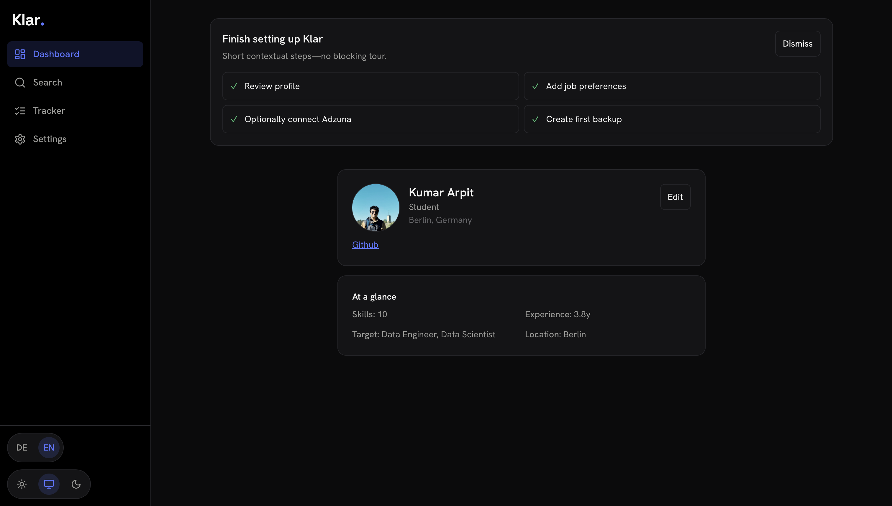
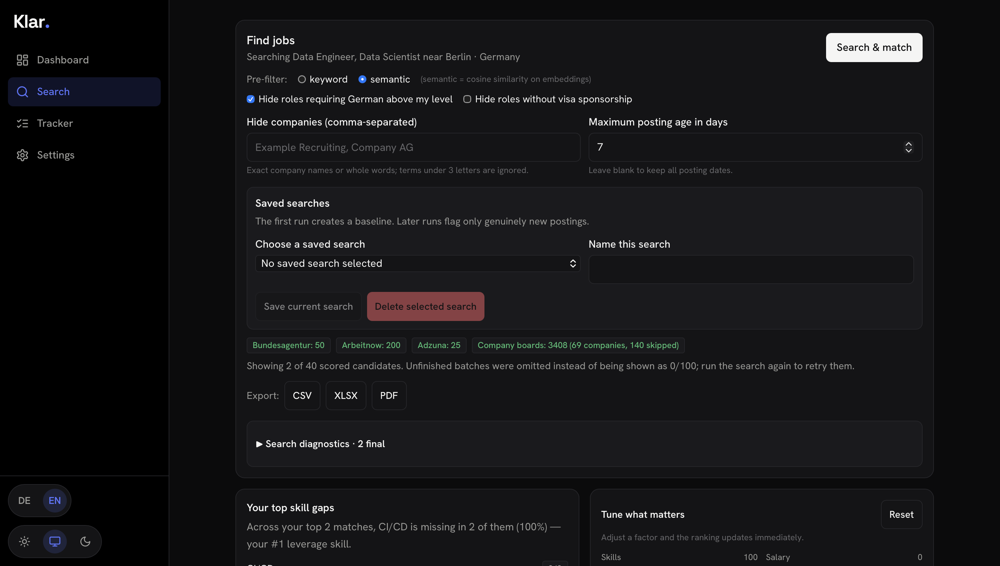

# <center> Klar </center>

## <center> Your next move, made clear. </center>

Klar brings your entire job search into one calm, private workspace. Discover live roles, understand where you fit, create stronger applications, and keep every opportunity moving, without losing yourself in tabs, spreadsheets, and scattered notes.

[**Open Klar →**](https://karpit0499.github.io/klar/) · [See what’s new in v2.5.3](CHANGELOG.md)


_**Klar Dashboard**_


_**Klar Search**_

---

## From searching to applying. All in one place.

### Find roles worth your time

Search live opportunities across Germany and nearby European markets. Klar brings together public job feeds, employer career pages, and official application routes, removes repeated listings, and helps you focus with filters for location, distance, recency, employment type, language, and more.

When a search returns nothing, Klar does not leave you guessing. It shows what happened, which sources responded, which filters removed results, and what you can try next.

### Start the way that fits you

Klar meets you where you are. Choose the path that matches your search and it sets up only what you need:

- **Build a career profile** to match roles against a structured résumé.
- **Find flexible work** like minijobs, part-time, working-student, weekend, evening, and seasonal roles, all without uploading a résumé at all.
- **Explore Klar first** in a temporary sample workspace where nothing is saved.
- **Restore a backup** and pick up exactly where you left off.

Setup remembers where you stopped, so you can leave and continue later instead of starting over.

### Flexible work, searched properly

If you are looking for shift work rather than a career move, Klar searches the employers who actually hire for it, not just the job boards that happen to list them.

Results arrive while the search is still running, so you are reading real openings within seconds instead of watching a spinner. Every search finishes, on time, every time. If a source is slow or unavailable, Klar tells you plainly and shows you what it did find, rather than pretending the result is complete.

Some employers do not post individual openings at all. Klar shows those as **open applications** instead, with a clear, distinct treatment and a direct route to the employer's own application page, so a quiet employer is still a real opportunity rather than an empty gap.

### See the match. Understand the reason.

Klar reads your résumé and compares it with each role. Every match comes with a clear score breakdown, the strengths working in your favour, and the gaps worth considering.

Adjust what matters most to you. Save the promising roles. Hide the noise. Come back to a saved search and see what is genuinely new.

### Keep your résumé in one trustworthy place

Your résumé is the single source of truth behind everything Klar does. Edit it directly inside Klar, for example, experience, education, skills, projects, certifications, and languages. Reorder what matters, and undo a change if you go too far. A structural completeness check points out missing dates or roles without achievements, and earlier versions are kept so you can look back or restore one.

### Make every application feel considered

Turn one résumé into a focused application for each opportunity. Klar can help you:

- Tailor your résumé in English or German.
- Download clean, ATS-friendly DOCX and PDF files.
- See which important keywords are covered or missing, and re-run tailoring focused on the gaps.
- Review every change before you download it, with the reason, the evidence and the factual status shown for each one, and accept, reject or edit them one at a time.
- Draft a cover letter grounded in your real experience, in a Concise, Balanced or Formal tone, plus a short message for an email or a LinkedIn note.
- Keep an application packet per job, saved as you work, with English and German prepared independently.
- Build a tailored résumé **with no AI at all** — instant, no API key, no usage limits. Klar reorders your own wording so what this posting asks for comes first, and never changes your sentences.
- See what an AI request will cost before you spend it, and get a straight answer when a request is too large rather than a retry that cannot work.
- Prepare interview questions, talking points, and honest ways to address gaps.
- Explore salary context and estimate German take-home pay.

Klar is designed to strengthen your story, not invent a new one. Generated material stays tied to the specific bullets and facts in your résumé and should always be reviewed before you send it.

### Reach out for flexible work without a résumé

For a minijob, a weekend shift or a working-student role, Klar builds a short, truthful message from the details you chose to enter, sums up your availability, and can print a one-page profile card. You copy the message into the employer's own official application route. Klar never fills in a form, never submits, and never applies for you.

### Use your own AI engine

Klar talks to one OpenAI-compatible endpoint, and you decide which one. The default is a hosted service; Settings lets you point Klar somewhere else, pick the model, and check which models that endpoint actually offers. A local model on your own machine is not yet supported from the hosted site, because a browser blocks a plain-http endpoint from an https page — Klar says so plainly instead of pretending otherwise.

### Keep momentum without the spreadsheet

Move applications through a simple visual tracker. Add notes, contacts, reminders, and follow-ups. See older listings that may need attention, switch between board and list views, and export your progress whenever you need it.

---

## Honest about where information comes from

Klar labels what it knows against what it worked out.

A wage, a posting date, or a location that came from the employer is shown as published. Anything Klar inferred, for example the kind of workplace a role sits in, is marked as inferred and is never dressed up as fact. Listings that have expired drop out instead of lingering.

If a search could not finish a source in time, Klar says so, names the source, and still shows you everything else. A partial answer that admits what is missing is more useful than a complete-looking answer that is quietly wrong.

---

## Private by design

Your career is personal. Klar treats it that way.

- Your résumé, profile, saved jobs, applications, and preferences stay in your browser.
- Klar has no application server that stores your career history.
- Your Groq key is relayed to Groq by Klar’s fixed, no-storage Worker endpoint
  for AI features. It is never stored by Klar’s Worker, put in a URL, or echoed
  back to the app.
- Optional vault protection can encrypt sensitive career data and saved credentials on your device.
- A standard backup never contains API credentials.
- A complete encrypted backup can move credentials safely while keeping them unreadable.
- A readable data export is separate, clearly warned, and always requires confirmation.

Employer sources are reached through a small, strictly limited relay that can only read from a fixed, published list of employer sites, and only ever reads. It cannot be pointed at anything else, and no part of your workspace passes through it.

When you use an AI feature, the information needed for that feature and your
per-request authorization are relayed to Groq for processing. Klar’s Worker does
not store either one. If you enable the vault, keep your passphrase safe as Klar
cannot recover it.

---

## Built for a European job search

Use Klar in **English or German** across desktop and mobile. Search coverage includes:

- Germany
- Austria
- Switzerland
- The Netherlands
- Luxembourg
- Liechtenstein

Available roles vary by country, employer, and original job source. Flexible-work employer coverage is currently focused on Germany.

---

## New in v2.4

### Flexible work that searches real employers, and tells you the truth about it.

Klar v2.4 turns Flexible Work from a setup screen into a working search, and puts an honest, resilient source layer underneath it.

- **A real flexible-work search** — search minijobs, part-time, working-student, weekend, evening, and seasonal roles by city and work type, with no résumé at any point.
- **Results while you wait** — the first page appears as soon as there is enough to show, rather than after the slowest source finishes.
- **Searches that always end** — every search reaches a clear finish, and never runs past sixty seconds.
- **Employers, not just boards** — twenty-one employer families across groceries, drugstores, logistics, food service, and hotels, alongside the always-available public job sources.
- **Open applications** — employers who do not post individual openings appear as a clear, distinct route to their own application page instead of being missing.
- **Published or inferred, never blurred** — wages, dates, and locations are labelled by where they came from, and inferred details say so.
- **Honest partial results** — if a source cannot finish, Klar names it and still shows everything else.
- **A search that survives a bad source** — one broken or slow employer cannot break, delay, or empty your results.
- **Saved flexible searches** — name a search, come back to it, and see only what is genuinely new since last time.
- **Understands what the job actually is** — role, workplace, and schedule are recognised in German and English, including umlaut spellings, so a *Kassierer:in* and a *cashier* land in the same place.

[Read the complete changelog →](CHANGELOG.md)

---

## Start in a few minutes

You need a current browser. A [Groq API key](https://console.groq.com/) is needed only for AI features, and Klar asks for it at the moment one is used. Adzuna credentials are optional and add more listings and salary information where available.

1. [Open Klar](https://karpit0499.github.io/klar/).
2. Choose your language and appearance.
3. Pick how you want to start: career profile, flexible work, or a quick explore.
4. Upload a PDF or DOCX résumé and review it, or skip it entirely for flexible work.
5. Tell Klar what kind of role you want, and where.
6. Start discovering, comparing, and saving opportunities.

Klar can be installed from your browser for a more app-like experience.

---

## Good to know

- Job availability and freshness depend on the original providers.
- Employer coverage grows over time; a family that has no live openings still shows its official application route.
- Some sources or salary features may require separate credentials and may have quotas.
- AI-generated material should be reviewed before submission.
- Salary calculations are estimates, not tax or financial advice.
- Because your workspace is local, clearing browser data or moving to another device can remove it. Download backups regularly.

---

## For contributors

Klar requires Node.js 20.19 or newer, or 22.12 or newer, and npm.

```bash
git clone https://github.com/karpit0499/klar.git
cd klar
npm install
cp .env.example .env.local
npm run dev
```

`.env.local` holds one value, `VITE_WORKER_URL`. Set it to your deployed Worker
for reliable Groq access across desktop and mobile browsers and real
employer-source searches. If it is left empty, Flexible Work uses bundled
sample data and Groq falls back to a direct browser request.

Before proposing a change, run Klar's complete release check:

```bash
npm run qa
```

That checks the service worker, app and Worker types, generated Worker bindings,
all tests, the production build, and a Worker deployment dry run.

Optional browser end-to-end check. Note that `npm run build` targets the
GitHub Pages base path, so build with a root base before serving locally:

```bash
npm i -D playwright
npx playwright install chromium
npx vite build --base=/
DIST=dist node qa/server.cjs &
node qa/e2e.mjs
lsof -ti:4173 | xargs kill
npm run build
```

The production app is published from `main` through GitHub Pages.

---

## Release journey

- **v2.5 — Application Quality:** a per-change review with factual statuses and blocked unsupported figures, a visible keyword-coverage loop, requirements read from the posting itself, cover-letter tones in English and German, short messages, saved application packets, résumé-free flexible reach-out, and a configurable AI engine.
- **v2.4.3 — AI that fits a free plan:** résumé tailoring made small enough to succeed on a free AI tier, a visible cost estimate, honest refusals instead of futile retries, and a zero-AI tailoring path that needs no key at all.
- **v2.4 — Flexible Work & Source Fabric:** a working résumé-free flexible-work search, twenty-one employer families with guaranteed fallbacks, progressive results inside a sixty-second ceiling, published-versus-inferred provenance, open-application routes, and saved flexible searches.
- **v2.3 — Résumé foundation & adaptive onboarding:** one canonical résumé, an in-app résumé editor with history, adaptive onboarding, a résumé-free Flexible Work mode, a sample explore workspace, grounded applications, and safer exports.
- **v2.2 — Stability & Safety:** stronger privacy boundaries, trustworthy backups, honest search diagnostics, safer connections, and resilient recovery.
- **v2.1 — Reliability:** bilingual résumé improvements, consistent state, responsive fixes, and safer updates.
- **v2 — The complete workspace:** multi-country discovery, application tools, localization, accessibility, salary insights, and a redesigned experience.
- **v1 — The beginning:** private job discovery, matching, tracking, exports, and application support.

---

## License

Klar’s source is visible so its behaviour and privacy model can be inspected, but it is **not open source**. Copying, modification, redistribution, and independent deployment are restricted. See [LICENSE](LICENSE).

---

*Klar means “clear” in German. Built by Kumar Arpit.*
